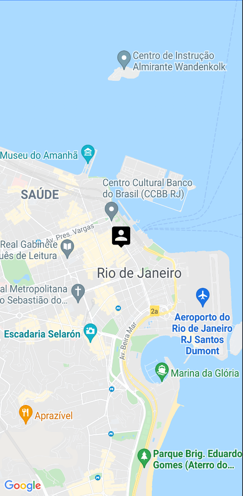

# Processo seletivo: Gaudium - Desenvolvedor Flutter
Bem vindo ao processo seletivo da Gaudium!

### Pré-requisitos
- Ter uma conta no GitHub
- Git instalado para fazer os commits do código no repositório próprio  ao longo da prova
  - Caso tenha dificuldades, recomendamos usar o GitHub Desktop
- Ambiente de desenvolvimento funcional que possa rodar o código em um dispositivo físico ou virtual
- Ter compatiblidade com as versões abaixo:
  - Flutter 3.16.8
  - Dart 3.2.5
- Ter uma cópia deste repositório a partir do botão "Use this template" e convidar o usuário gaudiumtecnicos@gmail.com ao repositório criado
- Internet estável
- Dispositivo com câmera para ficar manter ligada ao longo da prova

## Introdução

### O código atual

O código segue um projeto simples com apenas uma tela, a main, que possui um um mapa do Google Maps e exibe um marcador no centro do Rio de Janeiro. 

## Preparação
### Instruções

1. Você deverá clonar o repositório atual em um repositório próprio usando o botão verde de Usar template, no canto superior direito. 
2. Depois, convidar o usuário `gaudiumtecnicos@gmail.com` para o seu novo repositório, que ficará com o código da prova.
3. Por último, baixar e rodar o código do projeto _Entregaudium_ para garantir que está funcionando na sua máquina. Se achar necessário pode ajustar dependências, mas sem mexer no código principal. A intenção é apenas não ter surpresas durante a execução da prova para não perder tempo à toa.

Em casos de dúvida, basta entrar em contato.

Ao final de cada item concluído você deverá fazer um commit da alteração e, na descrição do commit, explicar o que foi feito e qual foi a motivação para as decisões tomadas. Após realizar o commit, **não se esqueça de fazer o push**, pois ele servirá de acompanhamento ao longo da prova.
